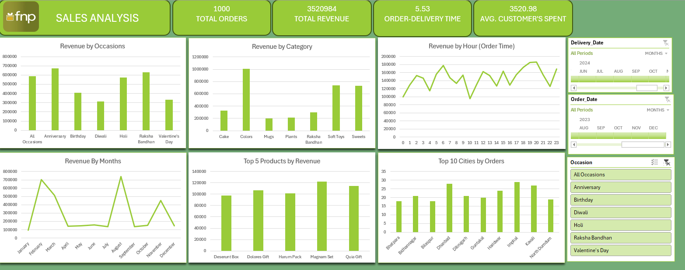

# FNP Sales Analysis Dashboard

## Overview
An Excel-based sales analysis dashboard for FNP (Ferns N Petals), analyzing 
order trends, revenue, and customer behavior across products, categories, 
occasions, and cities.

## Tools Used
- Microsoft Excel (PivotTables, PivotCharts, formulas, interactive slicers)

## Dataset
Three related tables:
- `orders` — order-level transaction data (order/delivery dates & times, quantity, location, occasion)
- `products` — product catalog (category, price, occasion tagging)
- `customers` — customer demographic and contact data

## Key Metrics Calculated
- Total Orders, Total Revenue, Average Order-to-Delivery Time, Average Customer Spend
- Revenue by Occasion, Category, Hour of Order, and Month
- Top 5 Products by Revenue
- Top 10 Cities by Order Volume

## Key Insights
- Holi generated the highest occasion-based revenue, at roughly ₹600K
- Colors was the top-performing product category, generating close to ₹1M in revenue
- Average order-to-delivery time across all orders was 5.53 days
- Average customer spend was ₹3,520.98 across 1,000 total orders

## Dashboard Preview

## Project Structure
FNP-Sales-Analysis/
├── README.md
├── data/
│   ├── orders.csv
│   ├── products.csv
│   └── customers.csv
├── excel/
│   └── FNP-SALES-ANALYSIS.xlsx
└── screenshots/
    └── dashboard_overview.png

## Author
Prithvi Taneja | [LinkedIn](https://www.linkedin.com/in/prithvi-taneja-9368562b0/) | prithvitaneja48@gmail.com
